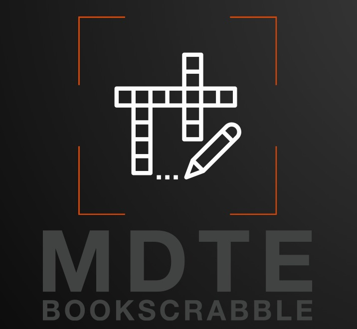

  

<h1 align="center" style="color: #FFA500; font-family: 'Arial Black', sans-serif; font-size: 36px;">Scrabble Game</h1>

Welcome to the <strong>Scrabble Game</strong>! Challenge your friends in this digital version of the classic board game. Test your word-building skills, strategic thinking, and aim for the highest score!

## Features

✨ **Multiplayer Mode:** Play against friends locally or online  
📚 **Scrabble Dictionary:** Validate words against an official Scrabble dictionary  
🏆 **Score Tracking:** Keep track of scores for each player throughout the game  
🎮 **Tile Management:** Drag and drop tiles on the board to form words  
💥 **Bonus Squares:** Strategically use special bonus squares to increase your score  
⏱️ **Turn-based Gameplay:** Experience the classic turn-based gameplay of the original board game

## Collaborators
* [Dan Davidovich](https://github.com/Davidovichdan)
* [Eviatar Didon](https://github.com/Eviatar109)
* [Matan Drabkin](https://github.com/matand380)
* [Tal Avraham](https://github.com/Tavraham)

## How to Play ?

1. Launch the game and select the desired game mode (multiplayer).
2. Follow the on-screen instructions to set up the game parameters (number of players, etc.).
3. On your turn, drag and drop tiles from your rack onto the board to form a valid word.
4. Once placed on the board, the word will be validated against the Book Scrabble dictionary.
5. Score points based on the letters used and any bonus squares covered.
6. Continue playing until all players have used all their tiles or no more valid moves are possible.
7. The player with the highest score at the end of the game wins.

 

## Video links

* Demo video - [press here](https://drive.google.com/file/d/1VIqe33EuEO65ZBNI2jGxJHj92qmRD5CP/view)
* Project presentation video - [press here](https://drive.google.com/file/d/1ZmUmJ-pTvVMvzWfuY6j6S5ZvdNAcZ2ss/view?usp=drive_link)

## JavaDoc
JavaDoc for the project can be found [here](https://matand380.github.io/Book_Scrabble_Project/BSP-JavaDoc/index.html)

[Back to Top](#scrabble-game)

## Project Scope
* This is our final project in Advanced Software Development course at the College of Management, conducted by Dr. Eliahu Khalastchi.
* The scope of the project is to develop a software application called Book Scrabble that allows users play a similar Scrabble game in multiplayer mode.
* The project will deliver a functional and user-friendly application to individuals who enjoy word games.

## Communication and Reporting
Communication and reporting will be done through the following channels:
* Weekly team meetings.
* The whole project will be handled in Jira as a project software platform.
* Writing code is an essential part of the project, and it will be done according to the project timeline and milestones.

## Risks and Mitigation
The potential risks associated with this project are:
* Scope creep
* Technical difficulties
* Team conflicts — Planning and executing a real programming project for the first time.

The following mitigation strategies will be implemented:
* Regular scope reviews to ensure project stays on track.
* Continuous testing and debugging to address technical difficulties.
* Open communication and collaboration to prevent and resolve team conflicts.

[Back to Top](#scrabble-game)

## Gantt

## Teams and work division

## 

[Back to Top](#scrabble-game)

  

